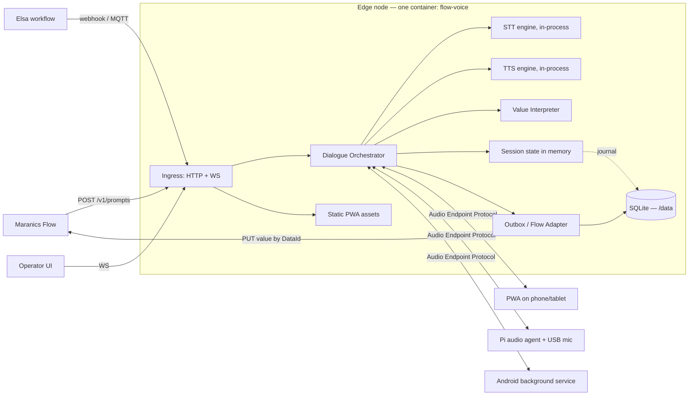
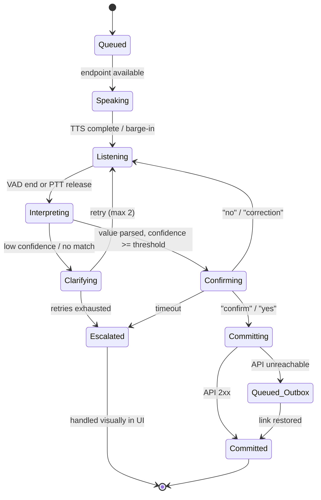

# Flow Voice — Architecture Specification

**Working name:** Flow Voice
**Purpose:** A closed-loop voice service that speaks checklist items aloud, captures the spoken answer, reads it back for confirmation, and writes the confirmed value into Maranics Flow via API.
**Status:** Draft v0.2 — for review (this copy is the brief the implementation follows; see README.md for what v0.1 of the code delivers)
**Packaging:** Single standalone Docker image. No external services required.
**Owner:** Mattias Larsson

---

## 1. Purpose and scope

Flow Voice is a self-contained PWA plus edge service that lets a signed-in user run a checklist by voice. The system reads out the next item, the user answers, the answer is read back for confirmation, and the confirmed value is written to Maranics Flow — which is what ticks the item off.

```
Sign in  →  pick a voice-ready checklist  →  run it item by item
```

A single exchange inside that run:

```
System   →  "Pilot on board?"
User     →  "Pilot on board five minutes ago."
System   →  "Pilot on board, 07:42 UTC. Confirm?"
User     →  "Confirmed."
System   →  writes 2026-09-09T07:42:00Z to NauticAI/ArrivalChecklist/PilotOperations/PilotOnBoard
```

### In scope

- Sign-in, and a picker showing which checklists can be run by voice right now.
- Sequential run-through: read out the next item, capture the answer, advance.
- Receiving individual prompts over HTTP POST, webhook, WebSocket or MQTT (secondary path).
- Text-to-speech read-out on a chosen audio endpoint.
- Speech capture, transcription, and value interpretation.
- Spoken read-back and explicit confirmation before commit.
- Writing the confirmed value back to Maranics Flow through its API.
- A web UI for sign-in, station pairing, live monitoring, and manual override.
- Running entirely on edge hardware, offline-capable, Docker-deployed.

### Out of scope (v1)

- Continuous ambient listening or open-ended conversation.
- Speaker identification as the primary authentication method.
- Authoring or editing checklist templates (that stays in Flow / the Template MCP).
- Cloud speech services as the default path (they remain an optional adapter).

### Non-goals worth stating explicitly

This is not a smart speaker. It answers a specific question at a specific moment, and it stops listening when that exchange ends. That constraint is what makes it acceptable on a bridge from a privacy and legal standpoint, and it should not be relaxed for convenience.

---

## 2. Design principles

| # | Principle | Consequence |
|---|-----------|-------------|
| 1 | **The brain and the ears are separate.** | Dialogue logic runs server-side; audio devices are interchangeable clients speaking a documented protocol. |
| 2 | **Nothing is written without confirmation.** | Every commit passes through a read-back step, configurable per DataId. |
| 3 | **Constrained grammar beats free transcription.** | The expected control type narrows the vocabulary before the audio is even captured. |
| 4 | **Edge-first, offline-tolerant.** | Local STT/TTS, durable local outbox, sync when the link returns. |
| 5 | **We record answers, not conversations.** | Audio lives in RAM for the interaction window only. Transcripts and decisions are the audit record. |
| 6 | **Voice is an input method, never the only one.** | Every voice prompt has a visual and manual equivalent in the UI. |
| 7 | **One image, no dependencies.** | `docker run` with one port and one volume. No Redis, no Postgres, no reverse proxy, no internet. |

Principle 1 is the important one. It means the same core runs behind a browser tab on a phone, a Raspberry Pi with a USB microphone on the bridge wing, and — later — an embedded endpoint inside the Flow app itself, without rewriting the dialogue engine.

---

## 3. System context



---

## 4. Component architecture

### 4.1 API Gateway

Single ingress for all trigger transports. Responsibilities: authentication, HMAC verification of webhooks, schema validation, idempotency, rate limiting, routing a prompt to the correct station queue.

Transports accepted: `POST /v1/prompts` (primary), signed webhook (`X-Flow-Signature`, HMAC-SHA256 over the raw body), WebSocket subscription to a Flow/Elsa event stream, MQTT topic subscription (`maranics/{vessel}/flowvoice/prompt`), and events/webhooks that start a whole run (section 10.4).

### 4.2 Dialogue Orchestrator

Owns the state machine for every prompt (section 7). Session state lives in memory with a write-through journal to the embedded store, so the container can restart mid-voyage without losing a queued prompt or an answer that was confirmed but not yet pushed. Enforces timeouts, retries, barge-in, priority ordering, and the confirmation policy.

### 4.3 Speech services

Pluggable adapters behind a stable interface. Default edge STT `whisper.cpp` / `faster-whisper` (Vosk, cloud as alternatives); TTS Piper (Coqui, platform TTS on Android, cloud); VAD Silero (WebRTC VAD); wake word openWakeWord (push-to-talk recommended on the bridge). STT runs with a biasing vocabulary supplied by the interpreter.

### 4.4 Value Interpreter

Converts a transcript into a typed value for a specific `Control.Type`. Deterministic parsers first; an optional small local language model handles free-text and messy phrasing. Never used as the only path for regulated fields.

### 4.5 Flow Adapter and Outbox

Writes the confirmed value to the checklist instance. Every commit is written to a durable local outbox first, then pushed. If the platform link is down, the answer is still captured, confirmed, and queued — the user is told "recorded locally, will sync".

### 4.6 Web app

React PWA built at image-build time and served as static assets by the same process, on the same port as the API. Screens: sign-in, station selection, active prompt with live transcript, checklist item list with status, manual answer/override, history and audit, admin (voices, languages, policies, device enrollment).

### 4.7 Voice profiles and item bindings

A binding ties one DataId to a spoken prompt, an expected type, phrases (which double as the STT biasing vocabulary) and a confirmation policy. A binding can fire three ways — an inbound API prompt, the user saying the phrase unprompted, or a tap on the item in the PWA — with the same interpretation and commit path. Profiles are files on the volume; one active profile per station.

```json
{
  "profileId": "arrival-bridge",
  "name": "Arrival — Bridge",
  "templateId": "NauticAI/ArrivalChecklist",
  "bindings": [
    { "bindingId": "pilot-on-board", "dataId": "NauticAI/ArrivalChecklist/PilotOperations/PilotOnBoard",
      "spokenPrompt": "Pilot on board?", "expect": { "type": "DateAndTime" },
      "phrases": ["pilot on board", "pilot embarked", "lots ombord"], "confirmation": "required", "defaultValue": "now" }
  ]
}
```

---

## 5. Primary flow — running a checklist by voice

Three screens: sign in (OIDC against the Maranics identity provider; the PWA remembers the station but never the user), the checklist picker (open instances plus templates the user may start; columns Checklist / State / Voice readiness / Last activity), and the run screen (big current item, live transcript, progress bar, push-to-talk, repeat, skip, manual entry).

**Voice readiness** is computed from the template: tasks whose `Control.Type` is voice-eligible (section 8) can be answered by speech; `Sign`, `Drawing` and attachments cannot; `Information` tasks are read only when "read notices" is on. A checklist with three signature tasks shows as *Partial — 3 items need the screen*; those are collected at the end. A profile improves a run but is not required.

**Run loop:** `speak prompt → open mic → interpret → read back → confirm → commit → advance`, in template order (section, then task). Rules: resume, don't restart (items that hold a value are skipped); non-eligible items are announced and parked; skipped items are offered again in a sweep before completion; the next prompt is only spoken after the previous value is in the outbox; conditional items are an open decision. The run announces itself ("Starting Arrival Checklist. Twenty-two items, three need the screen. First section, Pilot operations. Item one: pilot on board?") with verbosity *full* / *short* / *silent*; section changes are always announced. Spoken run commands: next · back · repeat · skip · pause · stop · "where am I" · "how many left". Run states: Active · Paused · Completed · Abandoned; one active run per user per station; a run survives a container restart and a dropped connection.

**"Ticked off" means the value is written.** Progress is derived from the instance. Completing the checklist is an explicit action, spoken or tapped, never automatic, and blocked while anything sits unsynced in the outbox.

**Run session API:** `GET /v1/checklists?voice=eligible`, `POST /v1/runs`, `GET /v1/runs/{id}/next`, `POST /v1/runs/{id}/answer|skip|pause|resume|complete`, `WS /v1/events` (`run.started` · `run.item.spoken` · `run.item.committed` · `run.item.escalated` · `run.completed`).

**PWA specifics:** audio needs a user gesture (the Start tap); screen wake lock during a run; foreground only on iOS; headset selection lives in the phone's settings; push-to-talk is a large on-screen button (a media key can be bound); installable and offline from shore (it talks to the container on the ship LAN).

---

## 6. Audio Endpoint Protocol (AEP)

A WebSocket carrying JSON control frames and binary audio frames.

Endpoint → server: `hello` (endpointId, capabilities: input, sampleRate, aec, pushToTalk, wakeWord), `ptt` (down/up), `audio.end` (reason); binary frames of 16 kHz mono PCM, 20 ms chunks, only while a capture window is open.

Server → endpoint: `speak` (promptId, audioFormat, bargeIn), `listen.open` (promptId, maxMs, vad), `listen.close`, `status` (state, text).

An external microphone is a capability of the endpoint, not a concern of the server. AEC is declared by the endpoint; if absent, the server disables barge-in and serialises speak/listen.

---

## 7. Dialogue state machine



Spoken control vocabulary (always available): confirm / yes · no · correction · say again · skip · cancel · louder · slower. Timeouts (defaults): listen window 8 s · confirmation window 10 s · whole exchange 60 s. On timeout the prompt escalates to the UI rather than failing silently.

---

## 8. Value interpretation by control type

| Control.Type | Parser | Example utterance | Result |
|---|---|---|---|
| `DateAndTime` | Temporal expression parser | "five minutes ago" | `2026-09-09T07:42:00Z` |
| `Time` | Clock parser | "zero seven four two" | `07:42` |
| `Date` | Date parser | "yesterday" | `2026-09-08` |
| `Number` | Numeral + unit | "twenty point five" | `20.5` |
| `Checkbox` | Yes/no lexicon; option title when authored with `values` | "affirmative", "utført" | `OK` for a plain box; the option key (`Utført::completed` → `completed`) when the template authored one — the hub reads the list from the template because the v3 flow read hides it; "no" writes nothing and leaves the item open. A yes/no answer is echoed ("Ladeplugg, Utført.") and written without a second "Confirm?" |
| `RadioButtons` without `Values` | Yes/no lexicon | "ja" | `Yes` / `No` |
| `QuickSelect` / `Dropdown` | Constrained match against `Values` | "not applicable" | `N/A` |
| `Text` | Transcript, lightly normalised | — | string |
| `LongText` | Transcript verbatim | — | string |
| `Sign` / `Drawing` | **Not voice-eligible** | — | escalate to UI |

Confidence gating per type; below threshold → *Clarifying*, never a guess. QuickSelect matching is bounded to the declared option set.

---

## 9. Time expressions

1. Anchor on the utterance (the moment the capture window closed, UTC from the edge node's synchronised clock), not the commit.
2. Store three fields: `value`, `utteredAt`, `committedAt`.
3. Read back absolute, not relative ("Pilot on board, 07:42 UTC").
4. Reject implausible values (future, or more than a configurable window — default 12 h — in the past) → clarify.
5. Support the phrasings crews use: "now", "just now", "five past", "at zero seven four two", "half an hour ago"; "when we passed the buoy" must clarify.
6. Local time vs UTC is a per-vessel setting; the read-back states which one it used.

---

## 10. API specification

`POST /v1/prompts` (Bearer service token, `Idempotency-Key`) with `target.stationId`, `checklist.{instanceId, templateId, templateName}`, `item.{dataId, prompt, expect.type, language}`, `policy.{confirmation, priority, timeoutSec, retries}`, `callbackUrl` → `202 { promptId, state: "queued", queuePosition }`. Also `GET /v1/prompts/{id}`, `POST /v1/prompts/{id}/cancel`, `POST /v1/prompts/{id}/answer`, `GET /v1/stations`, `POST /v1/stations/{id}/enroll`, `WS /v1/events`, `WS /v1/audio`, `GET /healthz /readyz /metrics`.

Events: `prompt.queued` · `prompt.spoken` · `answer.captured` · `answer.clarifying` · `answer.confirmed` · `answer.committed` · `answer.queued_offline` · `prompt.escalated` · `prompt.failed`. The completion callback carries promptId, state, dataId, value, transcript, confidence, utteredAt, committedAt, user, station, attempts.

**Starting a run from an event or webhook (10.4):** sources are Elsa webhooks (HMAC), Insight Center event sync, the edge MQTT broker (`maranics/{vessel}/flowvoice/run`), and `POST /v1/runs/trigger` (`templateId`, `stationId`, `trigger.{type, at}`, `autoStart`, `callbackUrl`). The event-to-checklist mapping lives on the volume as JSON (`on`, `start`, `station`, `debounceMin`, `autoStart`). Webhooks are HMAC-signed with a replay window; the idempotency key is mandatory; a debounce per mapping catches repeats; an active run for the instance means the trigger is acknowledged and ignored. A trigger creates a **pending run**, announced once ("Arrival checklist ready. Say start, or open it on screen."); `autoStart: true` is honoured only on host-audio endpoints for trusted sources. Fully offline. Callback on completion posts the run summary.

---

## 11. Write-back to Maranics Flow

Idempotent (promptId as key); authored by the signed-in user, not a service account; method attribution (`source: "voice"` plus confidence and transcript); durable outbox with backoff, ordered per instance, surviving restart; answering one item must never reset or lock the rest of the instance.

---

## 12. Stations, devices, and identity

Stations are named positions defined once in `/data/stations.json` (`stationId`, `name`, `location`, `defaultProfile`, `language`, `audioPolicy`, `autoStartAllowed`). A station may publish a revocable QR join token (poster): scanning it locks the phone to that station before sign-in, nothing more. A device enrolls once (admin approval or a short pairing code; revocable device token), picks a station visibly, and the user signs in (OIDC brokered by the container; the device holds only a session token). Several devices on one station: one active audio endpoint, the rest observe; take-over is explicit. Three identities kept separate: service (bearer/mTLS), device (enrollment token), user (OIDC, watch-length with idle timeout). Sign-in is on screen, never by voice; watch handover keeps the run and records both users; no user → nothing is read out or committed. Admin screen: stations, devices, active runs, pending enrollments.

---

## 13. Device and hardware profiles

A — fixed station (Pi 5 / small x86, USB mic, wired PTT); B — PWA (browser on phone/tablet, foreground only); C — Android agent (foreground service + WebView UI, hands-free rounds). All implement the same AEP. Build B first, A for the bridge, C when asked. Microphone choice matters more than the STT model; default to push-to-talk.

---

## 14. Deployment

One image, one process tree, one port (8443), one volume (`/data`: database, outbox, `stations.json`, voice profiles, event mappings). Optional `/models`, `/certs`, `--device /dev/snd`. Image variants `:slim` / `:1.0` / `:full` by bundled speech models. Sizing baseline 4 cores, 8 GB RAM. Speech engines sit behind adapters so `STT_ENDPOINT` / `TTS_ENDPOINT` can point at external services.

---

## 15. Privacy, audit, and retention

No continuous recording; audio is transient (RAM only between `listen.open` and `listen.close`); optional opt-in retention of audio for failed/corrected exchanges with a hard TTL; the audit record is text; the endpoint shows when the microphone is open; a crew notice is a delivery artifact.

---

## 16. Failure modes

No endpoint online → queue, escalate after timeout. STT/TTS failure → degraded, answer/prompt via UI. Flow API unreachable → outbox, "recorded locally". Unparseable → two clarifications, then escalate. Overlapping speech → discard, re-ask once. Prompt storm → priority queue, one exchange per station. Clock drift → block time-valued commits and alarm.

---

## 17. Security

TLS everywhere; HMAC-signed webhooks with replay window; station/device tokens scoped and revocable; short-lived user sessions with refresh and idle timeout; no secrets in the image; append-only exportable audit log.

---

## 18. Non-functional targets

Prompt-to-speech < 500 ms; full exchange < 12 s; WER < 5 % constrained with headset, < 15 % open bridge; availability 99.5 % underway; zero commit loss.

---

## 19. Phased delivery

P0 — PWA, one station, sign-in, picker, run screen with PTT, English, three control types, confirmation always, Flow write-back with outbox. P1 — full control-type coverage, resume and skip-sweep, screen tray, NO/EN/DE, voice profiles, Pi station, offline hardening, audit and admin UI. P2 — Android agent, inbound prompts into an active run, per-DataId confirmation, event capture beyond checklists, multi-station routing. P3 — speaker verification, embedded endpoint in the Flow app, fleet analytics.

---

## 20. Open decisions

1. PTT or wake word default (recommend PTT). 2. Confirmation policy per DataId vs blanket. 3. Prompt text source (task title vs a `SpokenPrompt` template field). 4. Local LLM for free text. 5. Relationship to the Flow app. 6. Time zone default. 7. Conditional items in the template model. 8. Voice eligibility computed vs flagged.

---

## 21. Native app — scope and screens

The app owns the microphone, speaker, headset, PTT, foreground service, login UI and token storage, rendering and a local cache; the edge service owns the state machine, STT/interpretation, item order, writes, outbox, audit. Screens: login, checklist list, current checklist (items with states Unanswered / Current / Answered / Skipped / Needs screen / Unsynced), item entry (manual fallback), settings. Actions: pause/resume, hand over, complete (only when required items are answered and the outbox is empty), discard (reason from the allowed list, screen-confirmed), reopen. Discard and Complete are screen-only. Recommendation: STT on the container, TTS on the device; on-device STT as a fallback. Build: Kotlin + Jetpack Compose with a `microphone` foreground service (or .NET MAUI if the Flow app is MAUI). Offline: works on the ship LAN; if the container is unreachable the app shows the cached list read-only.

---

## Appendix A — Worked example: engine started

`POST /v1/prompts` for `NauticAI/DepartureChecklist/Machinery/MainEngineStarted` (DateAndTime) → TTS "Main engine started?" → user "Engine started." → "Main engine started, now, 08:14 UTC. Confirm?" → "Confirmed." → value `2026-09-09T08:14:00Z`, source voice, confidence 0.97, user u_310. If the user says "engine started at zero eight zero five", the read-back is "08:05 UTC" and `utteredAt` remains 08:14.

## Appendix B — A full run, spoken

```
[ user signs in, taps Arrival Checklist, taps Start ]

APP   Starting Arrival Checklist. Twenty-two items, three need the screen.
      First section, Pilot operations.
      Item one. Pilot on board?
USER  Pilot on board five minutes ago.
APP   Pilot on board, 07:42 UTC. Confirm?
USER  Confirmed.
      [ commit → PilotOperations/PilotOnBoard = 2026-09-09T07:42:00Z ]

APP   Item two. Pilot card exchanged?
USER  Yes.
APP   Pilot card exchanged, yes. Confirm?
USER  Yes.

APP   Item three. Master pilot exchange completed?
USER  Say again.
APP   Item three. Master pilot exchange completed?
USER  Not applicable.
APP   Master pilot exchange, not applicable. Confirm?
USER  Confirmed.

APP   Next section, Machinery. Item four. Main engine started?
USER  Engine started.
APP   Main engine started, now, 08:14 UTC. Confirm?
USER  No.
APP   Main engine started. When?
USER  Zero eight zero five.
APP   Main engine started, 08:05 UTC. Confirm?
USER  Confirmed.

...

APP   Two items skipped. Go back to them?
USER  No.
APP   Three items need a signature on screen.
      Arrival checklist, nineteen of twenty-two answered.
      Open on screen to finish.
```

The read-back is always absolute, a "no" reopens the same item rather than failing it, and the run never advances until the previous value is committed to the outbox.
